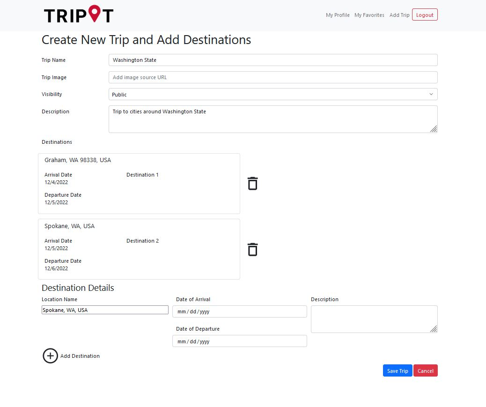
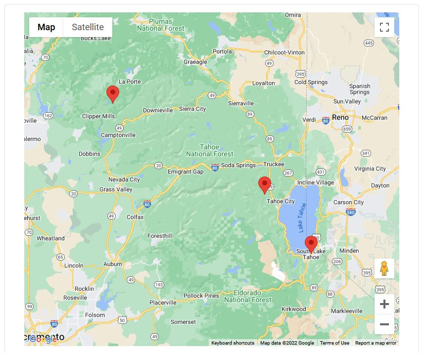
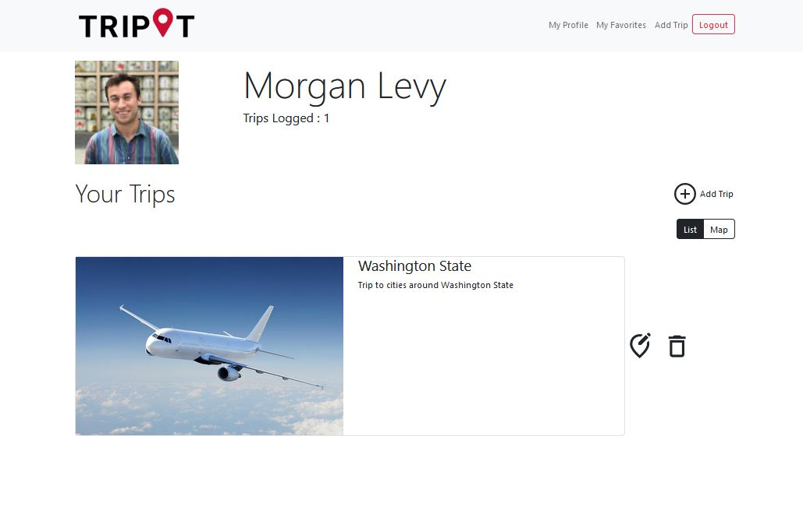
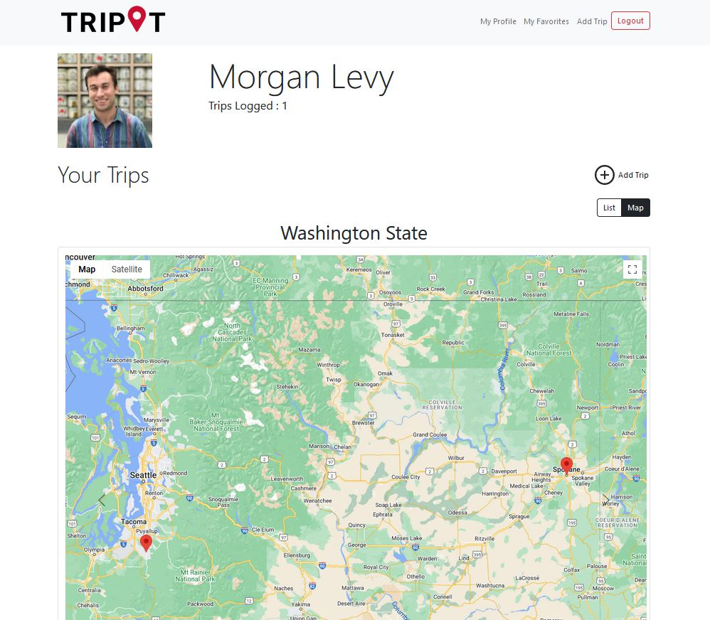
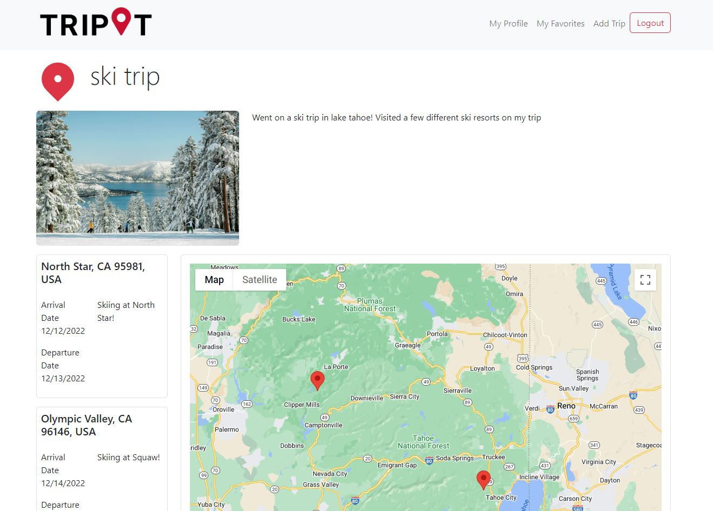
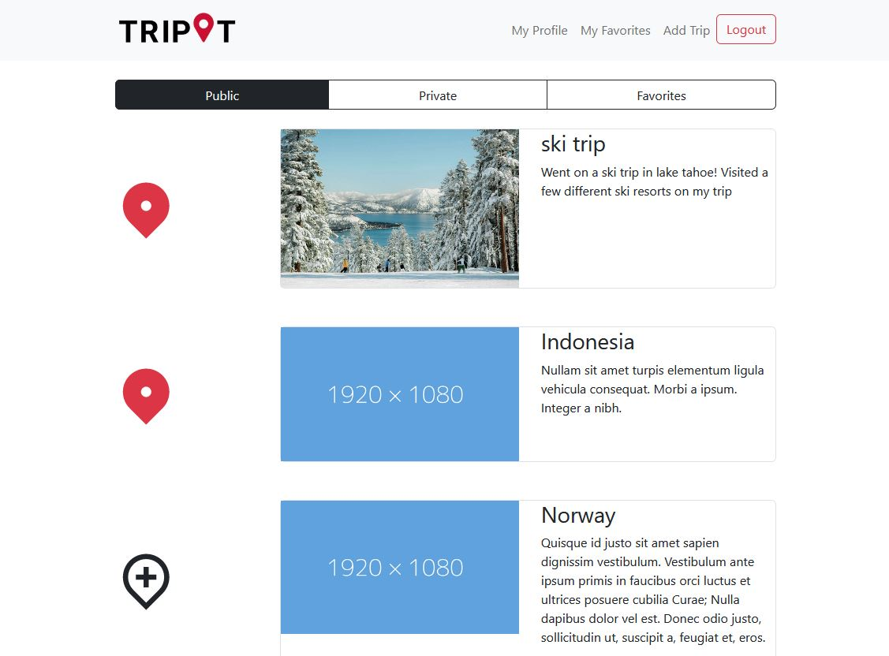

# teamkodak-frontend
Repository for all frontend code for Team Kodak's Group Project (TripIt Travel Logging Web App)

# [Link to Deployed Frontend](https://trip-it-frontend-teamkodak.herokuapp.com/)

## Iteration 3

### Team
- Debugging (LOTS of debugging)

### Morgan
- AddDestination component completed for the AddTrip page, with functional autocomplete to load
destination lat/long to work with Map component
- AddTrip component completed for user's to create and post (and edit) their trips
    
- Map component creation to use google maps api to show destinations associated with a trip
- Auto-zoom functionality implemented for Mapping of singular trips
    

### Stacy
- Handled all Heroku deployment of app and MongoDB online database
- Created Profile page (accessible from top of page) which utilizes Google Login info
- Profile page displays two views, controlled by Toggle button:
    - List View, displays trips as cards
        
    - Map View, displays singular trips on Google Map with carousel functionality to iterate through all the user's trips
        

### Steven
- Handled majority of final styling for web app components (TripDetails, AddTrip, Profile, NavBar, Trip Cards)
- Implemented the TripDetails page to display finalized trips
    
- Finalized Feed component to utilize all possible filters for trips
    

### Iteration 2 README additions:
#### Morgan

- Creation of an ApiKey via Google Credentials to allow for use of google components embedded into the Tripit web app. (Must be hardcoded in final code for use by other google users)

- Research into Google’s ‘Autocomplete’ react library to allow for autocompletion of locations via a search bar component.
- Implementation of the Autocomplete feature for adding ‘destinations’ on the AddDestination component. This feature returns a ‘Place’ object which gives location info (address, lat, long, etc.)

- Creation of the AddTrip.js frontend page, a page to create/edit trips by populating FormControl fields.
- Collaborated with group members to develop data schemas for the trips collection in our Mongo database

#### Stacy
- Profile Page Creation (not yet pushed as I am still working on functionalities)

#### Steven
- Add hooks for managing user favorites
- Clickable icons to add/delete favorite
- Implement logic to filter feed by favorites
- Implement My Favorites Component

### Iteration 1
#### Steven Fountain
Task Name: Implemented the frontend skeleton for the main trip's page
Task Description:
- setup react app
- add components
- add services
- add routes
- add initial navigation
ScreenShot Heroku FrontEnd:

Task Name: Implement Trip card component
Task Description:
- build Trip component to display a Trip
- have all info needed passed in as a prop
    - Trip name
    - Trip details
    - image url

Task Name: add TripIt logo
Task Description:
 - add logo to home page
- set logo as favicon
- add to /public/images

